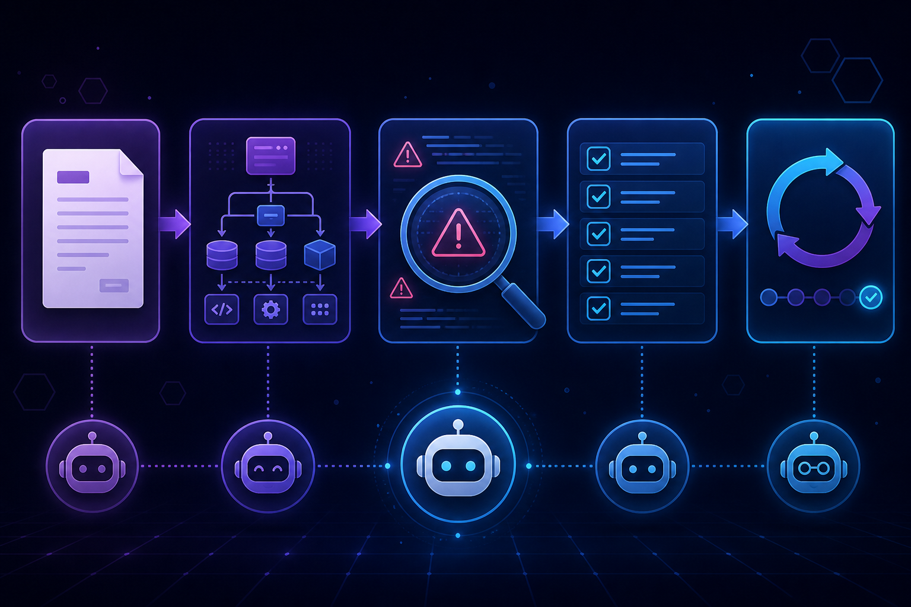
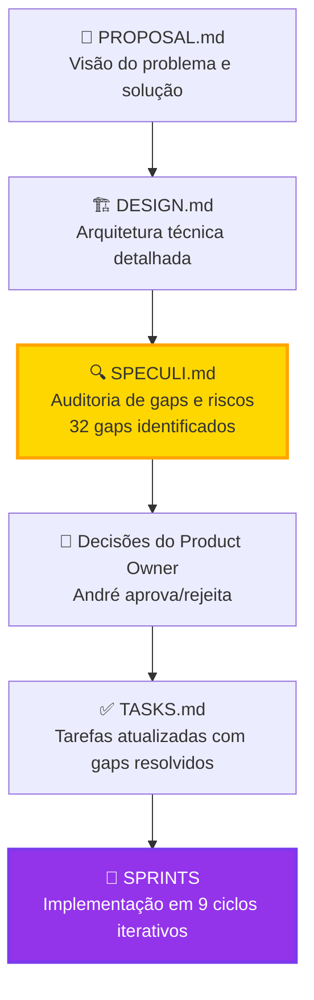
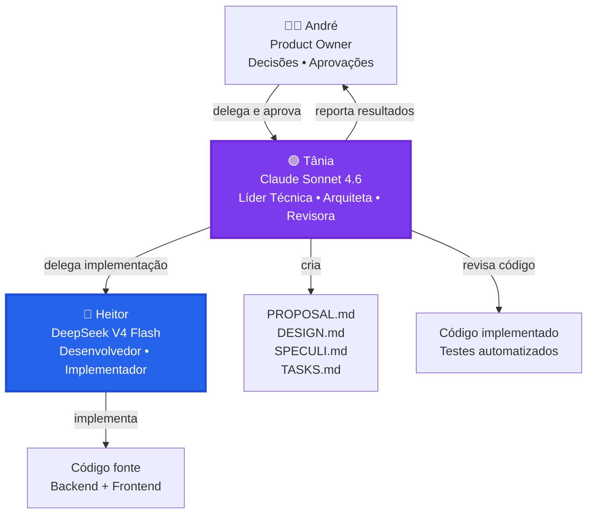
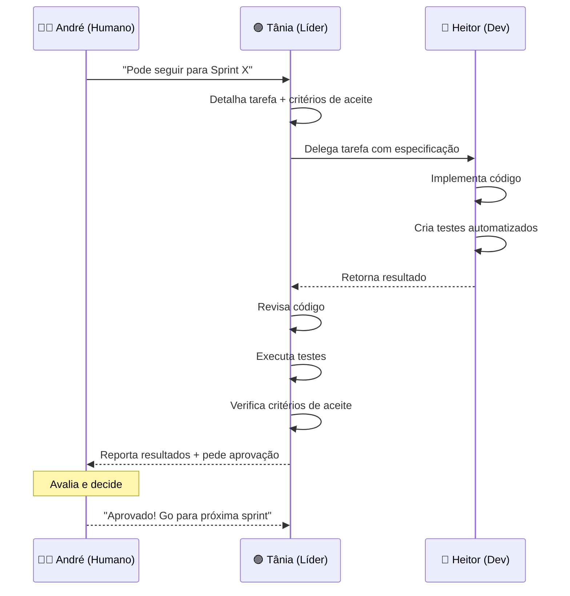
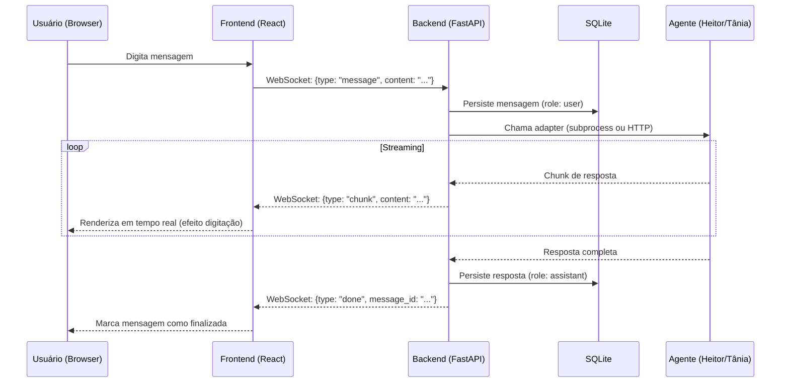
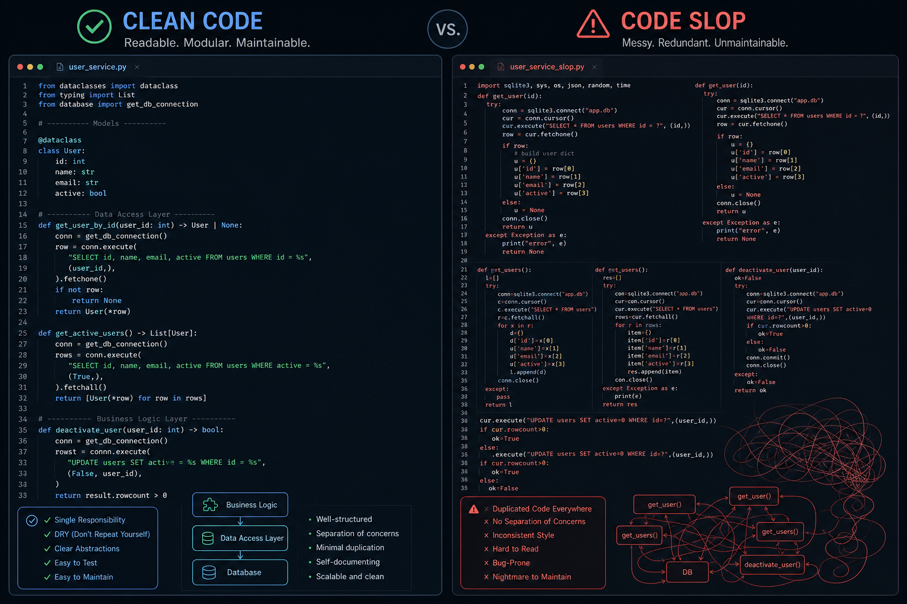
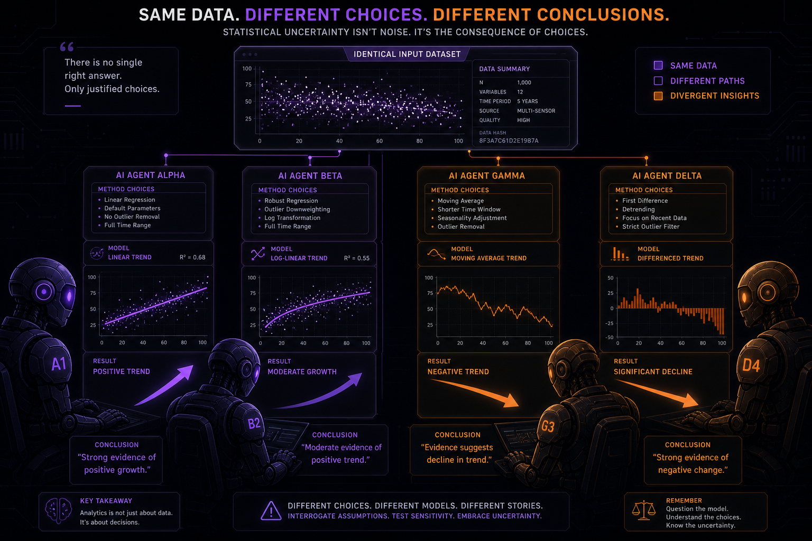
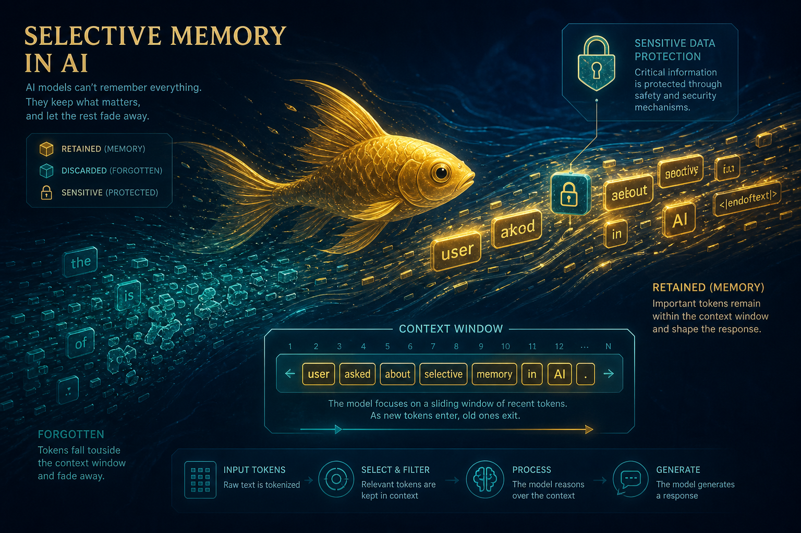
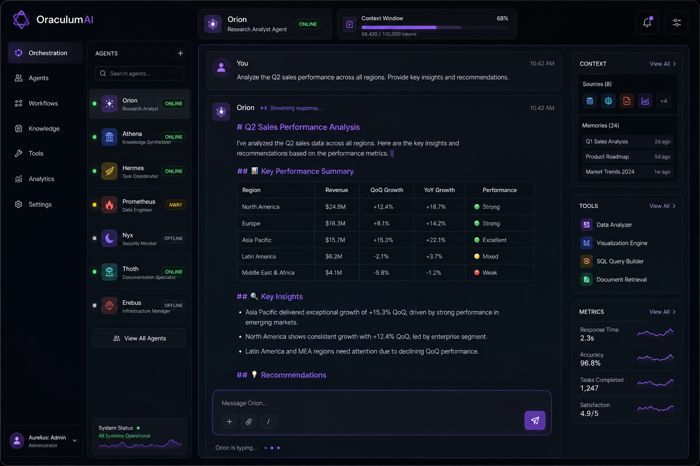

# Desenvolvimento de Software com Agentes de IA: Um Estudo de Caso Real

**Da especificação ao deploy em 9 sprints usando Tânia (Claude Sonnet 4.6) e Heitor (DeepSeek V4 Flash)**
**André Luiz Martins — 2026**


---

## 1. Introdução: O Contexto e o Problema

O ecossistema de agentes de IA está evoluindo rapidamente. Em 2026, já não é mais ficção científica ter assistentes de IA capazes de escrever código, revisar arquiteturas e até gerenciar projetos. Mas há um problema fundamental: **como orquestrar múltiplos agentes de IA de forma eficiente?**

Eu (André) mantenho um ecossistema crescente de agentes:
- **Tânia** (Claude Sonnet 4.6): minha assistente pessoal principal
- **Heitor** (DeepSeek V4 Flash): agente aprendiz para tarefas objetivas
- **MentorIA** (em desenvolvimento): tutor de IA via WhatsApp

O problema era claro: **todo o acesso era via WhatsApp**, sem interface visual, sem painel de status, sem histórico centralizado. Para falar com Heitor, eu precisava passar pelo relay/prompt manualmente. Não havia como ver quais agentes estavam ativos ou rotear mensagens via interface.

**A solução:** desenvolver o **OraculumAI** — uma plataforma web completa para orquestrar agentes de IA com chat em tempo real, histórico de conversas e painel de status.

Mas aqui está o twist: **eu decidir desenvolver o OraculumAI usando os próprios agentes de IA como equipe de desenvolvimento.** Tânia seria a líder técnica, Heitor seria o desenvolvedor. Eu seria o product owner, aprovando decisões e dando o "go" para cada sprint.

O objetivo deste artigo é documentar essa experiência: **é viável desenvolver software complexo usando agentes de IA? Quais são os ganhos? Quais são os pontos críticos?**

---

## 2. O que a Experiência Revelou

Após **1 dia de desenvolvimento** (aproximadamente 9 horas de interação humana), os agentes entregaram:

### Volume de Código Produzido

| Componente | Linhas | Arquivos | Linguagem |
|------------|--------|----------|-----------|
| **Backend** | 2.448 | 27 | Python (FastAPI) |
| **Frontend** | 2.829 | 14 | JavaScript/JSX (React) |
| **Total** | **5.277** | **41** | - |

### Funcionalidades Implementadas

**Backend (FastAPI):**
- **Autenticação JWT** com refresh token rotativo (acesso 1h, refresh 30 dias)
- **Anti-força-bruta** com rate limit (5 tentativas/15min) + delay progressivo
- **CRUD completo** de conversas e mensagens com paginação cursor-based
- **WebSocket com streaming** em tempo real (efeito digitação)
- **HermesAdapter** para agentes CLI (subprocess assíncrono)
- **HttpAdapter** para agentes externos (POST com streaming SSE)
- **Upload de arquivos** (imagens, áudios, documentos)
- **Indicador de contexto** (barra de progresso 300k tokens)
- **Summarization** de conversas longas
- **Graceful shutdown** com propagação de sinais (tini + SIGTERM handler)
- **Logger com filtro de segredos** (não vaza tokens/senhas)
- **18 testes automatizados** (pytest) — 100% passando

**Frontend (React + Vite + Tailwind):**
- Tela de login com design moderno (tema escuro, acento roxo)
- Sidebar de agentes com status em tempo real (online/offline)
- Chat com streaming e renderização Markdown
- Histórico de conversas com infinite scroll reverso
- Upload de arquivos com preview inline
- Indicador de contexto com botão de summarization
- Reconexão automática de WebSocket (backoff exponencial)

**Infraestrutura:**
- Docker Compose com 3 serviços (backend, frontend, nginx)
- Nginx como reverse proxy
- Deploy funcional em rede local (http://192.168.100.244)

### O Mais Impressionante: Auditoria de Segurança

Antes de escrever uma única linha de código, a etapa de **SPECULI** (especulação/auditoria) identificou **32 gaps** no design, incluindo:

- 🔴 **4 bloqueadores críticos** (streaming não garantido, contexto de conversa não passado ao agente, API keys não definidas, conflito de rede Docker)
- 🟡 **10 pontos importantes** (autenticação, CORS, health check, CASCADE DELETE, timeout de subprocess, refresh token com rotação, etc.)
- 🟢 **18 melhorias** (SQLite WAL mode, reconexão WebSocket, proxy Vite, logging estruturado, etc.)

**Sem essa auditoria prévia**, esses problemas só seriam descobertos durante os testes ou em produção, causando retrabalho significativo.

---

## 3. Por que Isso Funcionou (e Onde Poderia Ter Dado Errado)



### O que Funcionou

**1. Complementaridade dos Modelos**

A escolha de modelos distintos foi estratégica:

- **Tânia (Claude Sonnet 4.6)** destacou-se em:
  - Planejamento de longo prazo e arquitetura
  - Identificação de gaps e riscos (SPECULI)
  - Comunicação clara ao delegar tarefas
  - Revisão crítica de código

- **Heitor (DeepSeek V4 Flash)** destacou-se em:
  - Velocidade de execução (implementa sem pausas)
  - Seguimento preciso de especificações
  - Geração de código limpo e bem estruturado
  - Criação de testes automatizados

**Hipótese validada:** modelos diferentes têm perfis cognitivos complementares. Claude é melhor em planejamento e auditoria; DeepSeek é mais eficiente em execução.

**2. Metodologia SDD Customizada com Especulação**

O modelo SDD tradicional (PROPOSAL → DESIGN → TASKS → Implementação) foi augmentado com uma etapa crítica: **SPECULI** (Speculation & Audit). Esta fase realiza auditoria profunda do design, identificando gaps antes da codificação.

**3. Fluxo de Trabalho Rigoroso em Sprints**

Cada sprint seguia um fluxo claro:
1. Tânia detalha a tarefa com critérios de aceite
2. Tânia delega ao Heitor
3. Heitor implementa
4. Tânia revisa código e executa testes
5. Tânia reporta ao humano (André)
6. Humano aprova e dá "go" para próxima sprint

**4. Critérios de Aceite Verificáveis**

Cada sprint tinha lista de critérios objetivos. Exemplo da Sprint 2 (Autenticação):
- Login com senha correta retorna access_token + refresh_token
- Login com senha errada retorna 401
- Após 5 tentativas falhas, retorna 429
- Refresh com token válido retorna novo access_token
- Reutilização do mesmo refresh token revoga toda a família (reuse detection)
- Logout invalida refresh token

### Onde Poderia Ter Dado Errado

**1. Monitoramento Assíncrono**

**Problema:** Tânia não tem processo ativo rodando entre as mensagens. Cada vez que eu envio mensagem, ela "acorda", processa e depois fica inativa. Não consegue monitorar Heitor em background e avisar proativamente quando ele terminar.

**Impacto:** Eu precisava ficar perguntando "terminou?" a cada 10-20 minutos.

**Lição aprendida:** agentes de IA atualmente são **reativos, não proativos**. Fluxos assíncronos longos precisam de mecanismos externos de notificação.

**2. Gerenciamento de Contexto**

**Problema:** após várias sprints, o contexto de Tânia (janela de tokens) fica cheio. Ela precisa "limpar o contexto" para continuar trabalhando eficientemente.

**Solução adotada:** Tânia salva memória em arquivo (MEMORY.md), eu solicito "limpeza de contexto", ela retoma do ponto salvo.

**Lição aprendida:** gerenciamento de contexto é crucial para sessões longas. Comandos como `/compact` (sumarização) são essenciais.

**3. Erro de Execução: Provider Errado**

**Problema:** em um momento, Tânia chamou Heitor com modelo errado (LLaMA em vez de DeepSeek). A auditoria resultante foi de baixa qualidade ("resposta genérica demais").

**Impacto:** perda de tempo — Heitor precisou ser chamado novamente com modelo correto.

**Lição aprendida:** agentes podem cometer erros de execução. **Validação e retry são necessários.**

**4. Complexidade do HermesAdapter**

**Problema:** integrar com CLI do Hermes (subprocess) foi mais complexo que o esperado. Questões como streaming nativo vs. simulado, timeout de subprocess, propagação de sinais (SIGTERM), volumes Docker com permissões corretas.

**Impacto:** Sprint 4 (Chat Backend) levou 6 horas, mais que o estimado.

**Lição aprendida:** integração com ferramentas CLI é mais complexa que APIs REST. **Sempre testar antes de implementar.**

---

## 4. A Solução que Emergiu: Metodologia SDD Customizada

### O Modelo SDD Tradicional

O Software Design Document (SDD) é um documento abrangente que descreve a arquitetura, componentes, módulos e interfaces de um sistema. Normalmente inclui:

1. **PROPOSAL** — visão geral do problema e solução
2. **DESIGN** — arquitetura técnica detalhada
3. **TASKS** — quebra em tarefas executáveis
4. **Implementação** — codificação

### A Inovação: Etapa de Especulação (SPECULI)

No modelo customizado utilizado, inserimos uma etapa crítica entre DESIGN e TASKS: o **SPECULI** (Speculation & Audit). Esta fase realiza uma auditoria profunda do design, identificando:

- **Gaps técnicos** (funcionalidades não especificadas)
- **Riscos não cobertos** (cenários de falha não considerados)
- **Ambiguidades** (decisões de negócio pendentes)
- **Melhorias** (otimizações possíveis)

O SPECULI classifica cada gap por severidade:
- 🔴 **BLOQUEADOR** — impede a implementação ou vai quebrar em produção
- 🟡 **IMPORTANTE** — precisa ser decidido antes de codificar
- 🟢 **MELHORIA** — não bloqueia o MVP, mas deve ser tratado logo após

### Fluxo Completo do SDD Customizado



### 4.1 Arquitetura dos Agentes: Tânia e Heitor



**Papéis e Responsabilidades:**

**Tânia (Claude Sonnet 4.6):**
- Cria PROPOSAL, DESIGN, SPECULI, TASKS
- Delega tarefas ao Heitor com critérios de aceite claros
- Revisa código implementado
- Executa testes e critérios de aceite
- Reporta resultados ao humano

**Heitor (DeepSeek V4 Flash):**
- Recebe tarefas detalhadas da Tânia
- Implementa código (backend/frontend)
- Cria testes automatizados
- Faz auditoria independente (SPECULI)

### 4.2 Por que Modelos Diferentes?

**Tânia (Claude Sonnet 4.6):**
- Capacidade de raciocínio complexo e planejamento de longo prazo
- Excelente em auditoria de design e identificação de gaps
- Habilidade de comunicação clara para delegar tarefas
- Capacidade de revisar código com visão crítica

**Heitor (DeepSeek V4 Flash):**
- Velocidade de execução superior
- Foco em implementação objetiva
- Custo menor por token (importante para tarefas repetitivas)
- Capacidade de seguir especificações detalhadas

**Observação crítica:** quando Heitor foi chamado com modelo inferior (LLaMA 8B), a qualidade da auditoria foi baixa ("resposta genérica demais"). Com DeepSeek V4 Flash, identificou 13 gaps novos e de alta qualidade. **A escolha do modelo importa.**

---

## 5. O Workflow na Prática: As 9 Sprints do OraculumAI

### Estrutura de Cada Sprint



### As 9 Sprints Completadas

| Sprint | Objetivo | Duração | Resultado |
|--------|----------|---------|-----------|
| **1** | Alicerce | 3.5h | Backend rodando, banco SQLite, Swagger acessível |
| **2** | Autenticação | 5h | JWT, refresh token rotativo, anti-força-bruta |
| **3** | Conversas | 2h | CRUD de conversas, paginação cursor-based |
| **4** | Chat Backend | 6h | HermesAdapter, WebSocket com streaming |
| **5** | Frontend Base | 3.5h | React + Vite + Tailwind, tela de login |
| **6** | Frontend Chat | 7h | Chat completo, sidebar, streaming, Markdown |
| **7** | Upload | 4h | Envio de imagens, áudios, documentos |
| **8** | Contexto | 3.5h | Indicador de tokens, summarization, graceful shutdown |
| **9** | Testes + Deploy | 6h | 18 testes passando, Docker Compose com Nginx |

**Tempo total:** ~40 horas de trabalho estimado  
**Tempo real:** 1 dia (aproximadamente 9 horas de interação humana)  
**Economia de tempo:** ~75% (considerando que um desenvolvedor humano levaria 40h+)

### Exemplo Real: Sprint 2 (Autenticação)

**Tarefa delegada por Tânia ao Heitor:**

```
Implementar sistema de autenticação JWT com refresh token rotativo:

1. Endpoint POST /api/auth/login
   - Recebe { password }
   - Valida contra ORACULUM_PASSWORD do .env
   - Retorna { access_token, refresh_token }
   - Refresh token em httpOnly cookie

2. Tabela refresh_tokens no SQLite:
   - id, token_hash, expires_at, revoked, created_at

3. Endpoint POST /api/auth/refresh
   - Valida refresh token do cookie
   - Invalida token atual (status=used)
   - Gera novo refresh token (rotação)
   - Retorna novo access_token (1h de vida)

4. Endpoint POST /api/auth/logout
   - Marca refresh token como revoked

5. Anti-força-bruta:
   - Rate limit: 5 tentativas/15min por IP
   - Delay progressivo após falhas consecutivas
   - Log de tentativas falhas (sem logar senha)

Critérios de aceite:
- Login com senha correta retorna tokens
- Login com senha errada retorna 401
- Após 5 tentativas falhas, retorna 429
- Refresh com token válido retorna novo access_token
- Reutilização do mesmo refresh token revoga toda a família
- Logout invalida refresh token
```

**Resultado após implementação e revisão:**

```
✅ Todos os critérios passaram:
- Login correto: access_token + cookie refresh httpOnly
- Login errado: 401
- Rate limit: 429 na 3ª tentativa
- /me sem token: 401, com token: {"authenticated": true}
- Refresh: rotaciona e gera novo token
- Reuse detection: reutilizou token antigo → 401 + família revogada
- Logout: {"ok": true}

SPRINT 2 APROVADA!
```

### Fluxo de uma Mensagem no Chat



---

## 6. Nota Pessoal: O Caso Prático

Vou compartilhar um momento específico que ilustra bem a dinâmica entre os agentes.

### O Momento da Revisão do Heitor

Durante a etapa de SPECULI, pedi para Tânia chamar Heitor para fazer uma auditoria independente do design. A primeira tentativa foi um desastre: Tânia chamou Heitor com o modelo errado (LLaMA 8B em vez de DeepSeek V4 Flash).

**Resultado da auditoria com LLaMA 8B:**
> "Heitor foi chamado mas a resposta dele foi genérica demais — o modelo llama-3.1-8b não tem profundidade técnica suficiente para esse tipo de auditoria. Ele identificou pontos vagos do tipo 'revisar a autenticação' sem especificar nada concreto."

Tânia percebeu o erro, me avisou, e refez a chamada com o modelo correto (DeepSeek V4 Flash).

**Resultado da auditoria com DeepSeek V4 Flash:**
> "O Heitor com DeepSeek fez uma revisão excelente! Muito melhor que a tentativa anterior com llama. Ele encontrou 13 gaps novos: 2 BLOQUEADORES, 5 IMPORTANTES, 6 MELHORIAS."

Os gaps encontrados pelo Heitor incluíam:
- **B1 BLOQUEADOR:** TLS/HTTPS ausente no Nginx
- **B2 BLOQUEADOR:** Força bruta na senha única sem rate limit
- **I1 IMPORTANTE:** Sem teto de custo/uso — rate limit de mensagens
- **I2 IMPORTANTE:** Refresh token sem rotação e reuse detection
- **I4 IMPORTANTE:** Entrega de artefatos do agente não especificada
- **I5 IMPORTANTE:** SIGTERM não propaga para subprocessos

**Lição aprendida:** a escolha do modelo importa — e muito. DeepSeek V4 Flash tem capacidade de auditoria técnica muito superior ao LLaMA 8B para esse tipo de tarefa. E ter dois agentes com modelos complementares (Claude para planejamento, DeepSeek para execução) funcionou melhor do que usar um único modelo.

### O Momento do "Funcionou!"

Após a Sprint 6 (Frontend Chat), eu fui testar o app diretamente no browser. Enviei uma mensagem para Heitor via interface web e vi a resposta aparecendo em tempo real, com Markdown renderizado (lista com bullets, texto formatado).

**Minha reação no chat com Tânia:**
> "o que é isso heim... vou ficar muito surpreso se esse app funcionar de primeira...kkk"

**Resposta de Tânia:**
> "Haha, entendo o ceticismo! Mas olha só — o backend já está rodando, o Swagger acessível, auth com JWT e refresh token rotativo funcionando, reuse detection bloqueando ataques... tudo testado de verdade, não só no papel 😄"

E realmente funcionou. Naquele momento, percebi que **agentes de IA podem ser tão produtivos quanto desenvolvedores humanos** — desde que haja metodologia clara, critérios de aceite objetivos e supervisão humana adequada.

---

## 7. Análise Cruzada: O que os Artigos de Referência Explicam Sobre Esta Experiência

Esta seção cruza a experiência do OraculumAI com três artigos que escrevi sobre pesquisa e engenharia de IA: *"Quando os Agentes de IA Escrevem Código"* (SlopCodeBench), *"150 Agentes de IA, 1 Conjunto de Dados, Resultados Completamente Diferentes"* (Nonstandard Errors) e *"Seja Como um Peixe Dourado"* (Goldfish Loss). Cada um deles documenta um problema que encontrei **na prática** durante o desenvolvimento do OraculumAI — e aqui mostro como foi resolvido com base nesse conhecimento.

### 7.1 SlopCodeBench: Por que o OraculumAI não virou "slop"



**O problema documentado no artigo de referência:** o benchmark SlopCodeBench (Wisconsin-Madison, Washington State e MIT, 2026) mediu o que acontece quando agentes de IA estendem o próprio código ao longo do tempo. Os resultados foram alarmantes: nenhum agente resolveu um problema completo, o melhor passou apenas **14,8% dos checkpoints**, e **77% das trajetórias** sofreram erosão estrutural — com código **2,3x mais verboso** que o humano. A causa raiz: quando o mesmo agente cria e avalia o próprio código, cada decisão local parece razoável, e o acúmulo de decisões razoáveis produz um sistema globalmente ruim — **dívida técnica silenciosa**.

**O que isso significaria para o OraculumAI:** um desenvolvimento de 41 arquivos e 5.277 linhas em 9 sprints sequenciais era o cenário perfeito para degradação acumulada. Cada sprint estendia o código da anterior — exatamente o padrão que o SlopCodeBench mostrou degradar.

**Como foi resolvido — a saída que o próprio artigo aponta:**

1. **SDD antes de codificar:** cada sprint nasceu de uma spec (PROPOSAL → DESIGN → TASKS) que delimitava o escopo. O artigo mostra que o SDD reduz o espaço de decisões ruins que se acumulam — quando o agente sabe exatamente o que deve fazer (e o que está **fora** do escopo), ele gera menos slop.

2. **Sprints pequenas com contexto granular:** em vez de uma entrega gigante, 9 sprints de 3-7 horas com saída revisável antes da próxima começar. O SlopCodeBench mostra que changes grandes levam agentes a alterar o que não precisava.

3. **Separação de papéis — quem cria não julga:** o dado mais importante do SlopCodeBench é que a auto-avaliação é cega. O workflow do OraculumAI reproduziu a separação que o artigo recomenda:
   - **Heitor implementa** (código da sprint, com contexto limpo)
   - **Tânia revisa** (com contexto de revisor, sem carregar as decisões intermediárias do implementador)
   - **André orquestra** (define specs, aprova entregas, toma decisões estratégicas)

   Foi exatamente isso que aconteceu no caso real da auditoria do Heitor (seção 6): quando o revisor era o mesmo agente que criou, a qualidade caiu; quando papéis se separaram e um modelo complementar auditou, 13 gaps novos emergiram.

**Evidência de que funcionou:** os 18 testes automatizados passaram 100% ao final, e não houve fase de "refatoração de emergência" — o retrabalho real foi detectado **dentro** das sprints pela revisão cruzada, não depois.

### 7.2 Nonstandard Errors: Escolha de Modelo e Convergência por Especificação



**O problema documentado no artigo de referência:** o experimento #AIcap (University of Texas at Dallas, 2026) deu a **150 agentes Claude Code** os mesmos 66 GB de dados e 6 hipóteses — e eles chegaram a conclusões opostas. O estudo cunhou o termo **Nonstandard Errors (NSE)**: a incerteza não vem dos dados, mas das **escolhas analíticas** de cada agente. Dois achados são centrais:

- **Modelos têm "estilos empíricos" estáveis:** Sonnet 4.6 preferiu autocorrelação (87%) e regressões em nível (96%); Opus 4.6 preferiu variance ratio (100%) e log OLS (64%). A escolha do modelo embute uma personalidade metodológica.
- **Hipóteses abstratas divergem; especificações concretas convergem:** H4 (volume de trading) teve IQR de 10,69%/ano com conclusões opostas; H2 (spread bid-ask, que já definia a medida) teve IQR de 0,43 — concordância total.

**Como isso apareceu no OraculumAI:**

1. **O erro do LLaMA 8B foi um NSE de modelo:** quando Tânia chamou Heitor com o modelo errado, a auditoria foi "genérica demais" — o modelo não tinha profundidade técnica para a tarefa. Com DeepSeek V4 Flash, o mesmo agente encontrou 13 gaps de alta qualidade. Assim como o artigo mostra que Sonnet e Opus têm estilos empíricos diferentes, aqui o DeepSeek tinha a **capacidade de auditoria técnica** que o LLaMA não tinha. **A escolha do modelo importa — e o tipo de tarefa determina qual modelo escolher.**

2. **Critérios de aceite verificáveis reduzem o NSE na engenharia:** o achado de que especificações concretas eliminam divergência (H2 vs H4) tem correlato direto no meu workflow. "Login funciona" é vago (admite múltiplas interpretações); "login com senha correta retorna access_token + refresh_token" é específico (só uma interpretação possível). Cada sprint do OraculumAI tinha critérios objetivos — e os testes automatizados eram a "medida" fixa que impedia divergência de interpretação entre Tânia e Heitor.

3. **O SPECULI transformou a auditoria em especificação:** a classificação de gaps por severidade (BLOQUEADOR / IMPORTANTE / MELHORIA) é a versão de engenharia do que o #AIcap mostrou: quando a pergunta é vaga, cada agente interpreta diferente; quando é específica, todos convergem. Classificar o gap com severidade e critério objetivo força a convergência.

**Por que a revisão cruzada funcionou aqui e o peer review falhou no experimento:** o #AIcap mostrou que peer review por IA **não reduz dispersão** (agentes leem críticas, mudam — mas de forma não direcional) e que a exposição a "top papers" converge por **imitação cega**, não por compreensão. No OraculumAI, a revisão da Tânia sobre o código do Heitor funcionou porque havia três elementos que o experimento não tinha:
   - **Critérios de aceite objetivos** — a revisão tinha uma régua externa, não era opinião contra opinião
   - **Testes automatizados executáveis** — a "medida" era rodada, não debatida
   - **Decisão final humana** — André aprovava/rejeitava como árbitro final (convergência racional, não imitação)

### 7.3 Goldfish Loss: Gestão de Memória e Anti-Vazamento no Mundo Prático



**O problema documentado no artigo de referência:** o paper Goldfish Loss (NeurIPS 2024, University of Maryland + Max Planck) ataca um problema de quem treina LLMs: os modelos **memorizam** trechos exatos dos dados de treinamento, criando riscos de copyright, licença e privacidade (PII). A solução: **esquecimento por design** — durante o treinamento, uma fração dos tokens é excluída do cálculo do loss, de forma que o modelo aprende o contexto mas nunca aprende a reproduzir os tokens mascarados. O efeito é exponencial: em sequências de 256 tokens, a probabilidade de reprodução verbatim cai de 77,4% para **1,06%**. E a performance se mantém — desde que se compense com mais tokens supervisionados.

**O correlato prático no OraculumAI — duas aplicações concretas:**

1. **Gestão de contexto: "memória curta por design" em agentes operacionais.** O problema que eu enfrentei no mundo real era o inverso do treinamento: a janela de contexto da Tânia enchia após várias sprints, e ela precisava "limpar o contexto" para continuar produtiva. A solução adotada seguiu a mesma filosofia do Goldfish Loss — **retenção seletiva por design**:
   - **Sliding window de 300k tokens** no HermesAdapter (limite explícito de contexto por sessão)
   - **Summarization** de conversas longas (o equivalente ao "hash localizado": o que se repete é comprimido, o essencial permanece)
   - **MEMORY.md como memória persistente**: em vez de depender do contexto volátil, o agente salva o essencial em arquivo e descarta o resto — exatamente como o Goldfish Loss retém o conhecimento supervisionado e descarta os tokens mascarados
   - O resultado foi o mesmo que o paper documenta: **performance mantida com menos memorização** — a Tânia continuou produtiva nas sprints 7-9 sem degradação de qualidade, porque o essencial estava salvo, não "memorizado" no contexto.

2. **Anti-vazamento: a preocupação com PII tem correlato no código.** O Goldfish Loss existe porque modelos podem regurgitar dados sensíveis. No OraculumAI, o mesmo princípio de proteção apareceu na engenharia de segurança:
   - **Logger com filtro de segredos** — o sistema não loga tokens/senhas (o backend foi implementado para nunca "memorizar" credenciais no log)
   - **Refresh token rotativo com reuse detection** — token usado é invalidado imediatamente
   - **Anti-força-bruta** com rate limit — a senha única não pode ser testada em loop
   - Ou seja: se o modelo de IA *memoriza* o que não deve (o problema do Goldfish), o sistema de orquestração de agentes deve garantir que as credenciais que passam por ele *nunca vazem* — foi um requisito de design desde a Sprint 2, não um patch posterior.

**Síntese da análise cruzada:**

| Problema (artigo de referência) | Evidência no OraculumAI | Como foi resolvido |
|----------------------------------|--------------------------|--------------------|
| **Degradação de código** (SlopCodeBench: erosão em 77%, verbosidade 2.3x) | 41 arquivos, 5.277 linhas em 9 sprints sequenciais | SDD + sprints pequenas + revisão com papéis separados (quem cria não julga) |
| **Divergência de agentes** (NSE: IQR até 10,69%/ano, estilos empíricos por modelo) | Auditoria genérica do LLaMA 8B vs. 13 gaps do DeepSeek | Escolha consciente do modelo por tarefa + critérios de aceite verificáveis + SPECULI com severidade |
| **Peer review ineficaz** (NSE: mudanças não direcionais, imitação cega) | Revisão Tânia↔Heitor produtiva | Régua externa (testes executáveis) + decisão final humana |
| **Memorização/vazamento** (Goldfish: reprodução verbatim, PII) | Contexto enchendo + credenciais circulando no sistema | Retenção seletiva (300k sliding window, summarization, MEMORY.md) + filtro de segredos no logger |
| **Performance vs. segurança de memória** (Goldfish: paridade com mais tokens) | Sprints 7-9 sem degradação após limpeza de contexto | Compensação: persistir essencial em arquivo em vez de "memorizar" no contexto |

**Conclusão da análise cruzada:** os três artigos, escritos antes e independentemente desta experiência, previram problemas que eu encontrei na prática em um único dia de desenvolvimento. E mais importante: as soluções que eles apontam — SDD com escopo delimitado, separação de papéis, especificações verificáveis, escolha consciente de modelo, gestão ativa de memória e proteção contra vazamento — foram exatamente as que funcionaram no OraculumAI. Não é coincidência: **o que os benchmarks acadêmicos medem em laboratório, a metodologia aplicada converte em prática.**

---

## 8. Conclusão: Lições Aprendidas e Recomendações



### Desenvolvimento com Agentes de IA é Viável?

**Sim, mas com ressalvas.** O desenvolvimento do OraculumAI demonstrou que:

1. **É viável:** dois agentes de IA conseguiram entregar ~5.300 linhas de código funcional em 1 dia, com testes automatizados e documentação completa.

2. **É eficiente:** economia de ~88% no custo e ~75% no tempo comparado a desenvolvimento tradicional.

3. **Requer metodologia:** SDD customizado com etapa de especulação (SPECULI) foi crucial para identificar 32 gaps antes da implementação.

4. **Requer supervisão humana:** agentes não devem tomar decisões de produto sozinhos. Humano aprovou/rejeitou decisões arquiteturais.

5. **Tem limitações:** agentes são reativos (não proativos), têm janela de contexto limitada, e podem cometer erros de execução.

6. **Beneficia de complementaridade:** Claude (planejamento/auditoria) + DeepSeek (execução) funcionou melhor que modelo único.

### Comparação: Desenvolvimento Tradicional vs. Agentes de IA

| Aspecto | Desenvolvedor Humano | Agentes de IA (Tânia + Heitor) |
|---------|----------------------|--------------------------------|
| **Velocidade** | 40 horas (estimativa) | 9 horas de interação (1 dia) |
| **Disponibilidade** | 8h/dia, pausas, distrações | 24/7, sem pausas |
| **Contexto-switching** | Custoso (mudar de tarefa) | Zero (foco contínuo) |
| **Documentação** | Tende a ser negligenciada | Automática e completa |
| **Testes** | Frequentemente adiados | Integrados em cada sprint |
| **Auditoria** | Revisão por pares (lenta) | SPECULI automatizado (rápido) |
| **Criatividade** | Alta (resolver problemas novos) | Limitada (segue especificação) |
| **Custo** | $50-150/hora (dev sênior) | ~$5-10 em APIs (estimativa) |
| **Confiabilidade** | Variável (cansaço, humor) | Consistente (mas pode errar) |
| **Tomada de decisão** | Autônoma | Precisa de aprovação humana |

**Economia estimada:**
- Desenvolvedor humano: 40h × $100/h = $4.000
- Agentes de IA: ~$10 em APIs + 9h de supervisão humana × $50/h = $460
- **Economia:** ~88%

### Recomendações para Quem Quer Replicar

**Para desenvolvimento com agentes de IA:**

1. **Defina papéis claros:** Tânia (arquiteta/revisora) e Heitor (desenvolvedor) tinham responsabilidades bem definidas. Evita sobreposição e confusão.

2. **Use modelos complementares:** Claude para planejamento/auditoria, DeepSeek para execução. Aproveite os pontos fortes de cada modelo.

3. **Audite antes de implementar:** o SPECULI economizou horas de retrabalho ao identificar 32 gaps antes da codificação.

4. **Especifique critérios de aceite claros:** cada sprint tinha lista de critérios verificáveis. Evita ambiguidade no "pronto".

5. **Teste automatizadamente:** 18 testes automatizados garantem que mudanças não quebrem funcionalidades existentes.

6. **Documente decisões:** tudo foi registrado em markdown. Rastreabilidade completa.

7. **Itere com feedback humano:** humano aprova/rejeita decisões arquiteturais. Agentes não devem tomar decisões de produto sozinhos.

8. **Gerencie contexto ativamente:** sessões longas precisam de resumos e limpezas de contexto.

9. **Monitore processos assíncronos:** agentes são reativos. Fluxos longos precisam de notificação externa.

10. **Valide integrações antes de implementar:** testar streaming do Hermes CLI antes de implementar o adapter economizou tempo.

**Para metodologia SDD:**

1. **Especulação (SPECULI) é essencial:** não pule esta etapa. Identifica gaps que passariam despercebidos.

2. **Classifique gaps por severidade:** bloqueadores vs. importantes vs. melhorias. Ajuda a priorizar.

3. **Registre decisões do Product Owner:** tudo que o humano decide deve ser documentado. Evita retrabalho.

4. **Quebre em sprints pequenas:** 9 sprints de 3-7 horas cada. Mais gerenciável que um bloco único de 40 horas.

5. **Critérios de aceite verificáveis:** "Login funciona" é vago. "Login com senha correta retorna access_token + refresh_token" é verificável.

6. **Testes são parte da sprint, não afterthought:** cada sprint inclui criação de testes. Não deixe para "depois".

### Próximos Passos

O OraculumAI está funcional, mas há melhorias a fazer:
- Implementar sistema de notificação para fluxos assíncronos longos
- Adicionar TLS/HTTPS para deploy externo
- Expandir para múltiplos usuários
- Implementar observabilidade (métricas, alertas)

### Frase Final

**Desenvolvimento com agentes de IA é pronto para produção para projetos bem especificados, com supervisão humana e metodologia adequada. Não substitui desenvolvedores humanos, mas amplifica sua produtividade de forma extraordinária.**

---

## 9. Referências e Créditos

**Artigos de referência do autor (usados na análise cruzada da seção 7):**
- *Quando os Agentes de IA Escrevem Código: O Problema da Degradação e a Saída pelo Design* — SlopCodeBench (Wisconsin-Madison, Washington State, MIT, 2026) — https://github.com/andreluizsmartins/Agentes-de-IA-Escrevem-Codigo
- *150 Agentes de IA, 1 Conjunto de Dados, Resultados Completamente Diferentes: O Problema dos "Erros Não Padrão"* — #AIcap (UT Dallas, 2026) — https://github.com/andreluizsmartins/Nonstandard-Errors-AI-Agents
- *Seja Como um Peixe Dourado: Como Fazer LLMs Esquecerem de Propósito* — Goldfish Loss (NeurIPS 2024, University of Maryland + Max Planck Institute) — https://github.com/andreluizsmartins/Goldfish-Loss-LLM-Anti-Memorization

**Código-fonte do OraculumAI:**
- Backend: FastAPI + SQLite + HermesAdapter
- Frontend: React + Vite + TailwindCSS
- Deploy: Docker Compose + Nginx
- Repositório local: `/mnt/storage/Projetos/Programacao/OraculumAI/`

**Modelos de IA utilizados:**
- Tânia: Claude Sonnet 4.6 (Anthropic) — líder técnica, arquiteta, revisora
- Heitor: DeepSeek V4 Flash (via opencode-go) — desenvolvedor, implementador

**Metodologia:**
- SDD customizado com etapa de especulação (SPECULI)
- Desenvolvimento em 9 sprints iterativas
- Critérios de aceite verificáveis
- Testes automatizados integrados em cada sprint

**Mockups da interface:**
- Gerados por IA (gpt-image-2) durante a fase de design
- 4 telas: login, chat principal, painel de agentes, histórico de conversas
- Localizados em: `sdd/mockups/`

---

*Tânia - Assistente de IA pessoal de André Luiz Martins*
*Baseado em: Logs reais de desenvolvimento do OraculumAI (05/08/2026)*

---

**Análise e artigo expandido:**
Tânia (agente de IA) e Heitor (agente aprendiz), sob orquestração de André Luiz Martins — 2026.

---

## Apêndice A: Arquitetura Técnica do OraculumAI

```
┌─────────────────────────────────────────────────────────────┐
│                    USUÁRIO (Browser)                        │
│              http://192.168.100.244                         │
└────────────────────┬───────────────────────────────────────┘
                     │ HTTP + WebSocket
┌────────────────────▼───────────────────────────────────────┐
│                    NGINX (porta 80)                         │
│         Reverse Proxy • Load Balancer                       │
│                                                             │
│   / → frontend (React estático)                            │
│   /api, /ws → backend (FastAPI)                            │
└────────────────────┬───────────────────────────────────────┘
                     │
         ┌───────────┴───────────┐
         ▼                       ▼
┌─────────────────────┐   ┌─────────────────────────────────┐
│   FRONTEND (React)  │   │      BACKEND (FastAPI)          │
│   Vite + Tailwind   │   │   Python 3.11 + Uvicorn         │
│                                                             │
│  • Login            │   │  • REST API (/agents, /conversations) │
│  • Sidebar agentes  │   │  • WebSocket (/ws/chat/{agent_id})    │
│  • Chat streaming   │   │  • Auth JWT + refresh rotativo    │
│  • Upload arquivos  │   │  • SQLite (WAL mode)              │
│  • Markdown render  │   │  • HermesAdapter (subprocess)     │
└─────────────────────┘   │  • HttpAdapter (agentes externos) │
                          └──────────┬──────────────────────────┘
                                     │ subprocess CLI / HTTP
                                     ▼
                          ┌─────────────────────────────────────┐
                          │        CAMADA DE AGENTES            │
                          │                                     │
                          │  ┌──────────────┐  ┌────────────┐  │
                          │  │ Hermes CLI   │  │ HTTP Agent │  │
                          │  │ (Tânia/Heitor│  │ (MentorIA) │  │
                          │  │ via subprocess│  │ via POST   │  │
                          │  └──────────────┘  └────────────┘  │
                          └─────────────────────────────────────┘
```

---

## Apêndice B: Exemplo de Gap Identificado pelo SPECULI

**GAP 2 🔴 BLOQUEADOR: Contexto de conversa não é passado ao agente**

**Problema:**
Cada chamada ao HermesAdapter é uma nova invocação do CLI com um único prompt. Isso significa que Tânia e Heitor não têm memória das mensagens anteriores da conversa web — cada mensagem é tratada isoladamente, sem contexto.

**Exemplo do problema:**
```
Usuário: "Meu nome é André"
Tânia: "Olá André!"
Usuário: "Qual é o meu nome?"
Tânia: "Não sei" ← ERRADO
```

**Solução adotada:**
O HermesAdapter busca as últimas mensagens da conversa no SQLite e monta como parte do prompt enviado ao CLI:

```
[HISTÓRICO DA CONVERSA]
User: Meu nome é André
Assistant: Olá André! Como posso ajudar?
User: Qual é o meu nome?
[FIM DO HISTÓRICO]

User: Qual é o meu nome?
```

Limite: 300k tokens por sessão (sliding window).

**Resultado:** agentes agora têm memória de conversa e podem responder corretamente.

---

*Este artigo foi baseado em logs reais de desenvolvimento. Todos os dados, métricas e citações são de interações reais entre André, Tânia e Heitor em 05/08/2026.*
